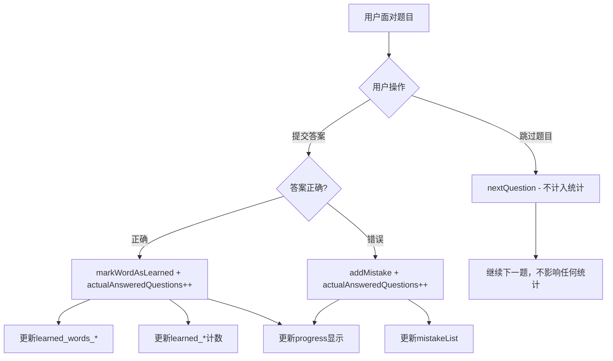

# 学习进度数据字段系统设计 PRD

**文档版本：** v1.0  
**创建日期：** 2024-12-19  
**负责人：** MeowBread Team  
**更新记录：** 首次创建完整的学习进度数据管理系统

---

## 🎯 概述

本文档详细定义了 MeowBread 日语学习小程序中所有与单词学习状态、答题记录、学习进度相关的数据字段和存储结构。基于这些基础字段，系统可以推导出总答题数、答对数量、准确率、单词书进度等关键统计信息。

---

## 📊 数据字段分类

### 1. 单词学习状态字段

#### 1.1 单词状态常量 (`utils/constants.js`)

```javascript
const WORD_STATUS = {
  UNSEEN: 'unseen',        // 未背 - 单词尚未被学习
  ERROR: 'error',          // 错误 - 用户在测验中答错了该单词  
  CORRECTED: 'corrected',  // 修正 - 单词曾被答错，但后来在重练中答对
  MEMORIZED: 'memorized',  // 已背 - 用户已掌握该单词，通过答题正确标记
};
```

#### 1.2 单词学习记录存储

**存储键：** `learned_words_${dictionaryId}`  
**数据类型：** Array  
**数据结构：**

```javascript
[
  {
    id: "假名_汉字_中文",                    // 单词唯一标识符（去除空格）
    wordData: {                             // 完整单词数据
      "假名": "ひらがな",
      "汉字": "平仮名", 
      "中文": "平假名",
      "词性": "名词",
      "例句": "例文です。"
    },
    learnedAt: "2024-12-19T10:30:00.000Z",  // 学习时间（ISO格式）
    status: "memorized"                     // 当前状态
  }
]
```

**功能：**
- 记录用户已经掌握的单词详细信息
- 支持按词典分别存储
- 自动去重，同一单词不会重复记录
- 包含学习时间，支持时间统计分析

#### 1.3 兼容性计数字段

**存储键：** `learned_${dictionaryId}`  
**数据类型：** Number  
**说明：** 保持与旧版本兼容，存储已背单词的数量

---

### 2. 错题记录字段

#### 2.1 错题列表存储

**存储键：** `mistakeList`  
**数据类型：** Array  
**数据结构：**

```javascript
[
  {
    data: {                                 // 完整单词数据
      "假名": "まちがい",
      "汉字": "間違い",
      "中文": "错误",
      "词性": "名词", 
      "例句": "間違いでした。"
    },
    status: "error",                        // 错题状态：error/corrected
    statusText: "错误",                     // 状态显示文字
    statusClass: "status-error",            // CSS类名
    mistakeTime: "2024-12-19T10:25:00.000Z" // 答错时间
  }
]
```

**功能：**
- 记录用户答错的单词
- 支持状态更新（错误→修正）
- 提供错题重练功能的数据基础

---

### 3. 答题统计字段

#### 3.1 答题记录存储

**存储键：** `userQuizStatistics`  
**数据类型：** Array  
**数据结构：**

```javascript
[
  {
    score: 8,                               // 得分（答对数量）
    totalQuestions: 10,                     // 实际回答的题目数（不包括跳过的题目）
    timeSpent: 120,                         // 用时（秒）
    accuracy: 0.80,                         // 准确率（0-1）= score / totalQuestions
    timestamp: "2024-12-19T10:30:00.000Z",  // 答题时间
    quizType: "quick",                      // 答题类型：quick/endless
    fromMistakes: false                     // 是否来自错题练习
  }
]
```

**功能：**
- 记录每次答题的详细统计（只计算实际回答的题目）
- 跳过的题目不计入任何统计数据
- 支持时间序列分析
- 区分不同答题模式的统计
- 确保准确率计算的准确性（排除跳过题目的干扰）

---

### 4. 用户设置字段

#### 4.1 词典选择

**存储键：** `selectedDictionary`  
**数据类型：** String  
**示例值：** `"everyones_japanese"` | `"liangs_class"` | `"duolingguo"`

#### 4.2 答题筛选设置

**存储键：** `quizFilter`  
**数据类型：** Object  
**数据结构：**

```javascript
{
  lessonFiles: ["everyones_japanese_lesson31", "everyones_japanese_lesson32"],
  dictionaryId: "everyones_japanese",
  selectedLessons: ["lesson31", "lesson32"]
}
```

#### 4.3 用户信息

**存储键：** `userInfo`  
**数据类型：** Object  
**数据结构：**

```javascript
{
  nickname: "用户昵称",
  avatarUrl: "头像URL",
  isLoggedIn: true,
  registrationDate: "2024-12-19T10:00:00.000Z"
}
```

---

## 🧮 推导统计信息

基于上述基础字段，系统可以推导出以下统计信息：

### 5.1 学习进度统计

```javascript
// 获取词典学习进度
function getLearningProgress(dictionaryId) {
  const learnedWords = getStorageSync(`learned_words_${dictionaryId}`) || [];
  const learnedCount = learnedWords.length;
  
  // 计算词典总单词数（从数据库文件计算）
  const totalCount = calculateTotalWordsInDictionary(dictionaryId);
  
  return {
    learnedCount,           // 已背单词数
    totalCount,             // 总单词数  
    progress: Math.floor((learnedCount / totalCount) * 100) // 进度百分比
  };
}
```

### 5.2 答题统计分析

```javascript
// 获取答题统计摘要
function getQuizStatisticsSummary() {
  const allStats = getStorageSync('userQuizStatistics') || [];
  
  return {
    totalQuizzes: allStats.length,                          // 总答题次数
    totalQuestions: allStats.reduce((sum, stat) => sum + stat.totalQuestions, 0), // 总题数
    totalCorrect: allStats.reduce((sum, stat) => sum + stat.score, 0),            // 总答对数
    averageAccuracy: calculateAverageAccuracy(allStats),                          // 平均准确率
    totalTimeSpent: allStats.reduce((sum, stat) => sum + stat.timeSpent, 0),      // 总用时
    bestAccuracy: Math.max(...allStats.map(stat => stat.accuracy)),              // 最佳准确率
    recentPerformance: allStats.slice(-10)                                        // 最近10次表现
  };
}
```

### 5.3 错题统计分析

```javascript
// 获取错题统计
function getMistakeStatistics() {
  const mistakes = getStorageSync('mistakeList') || [];
  
  const errorCount = mistakes.filter(item => item.status === 'error').length;
  const correctedCount = mistakes.filter(item => item.status === 'corrected').length;
  
  return {
    totalMistakes: mistakes.length,         // 总错题数
    activeErrors: errorCount,               // 当前错误状态
    correctedErrors: correctedCount,        // 已修正错题
    correctionRate: correctedCount / mistakes.length || 0  // 错题修正率
  };
}
```

### 5.4 学习效率分析

```javascript
// 计算学习效率指标
function getLearningEfficiency() {
  const quizStats = getQuizStatisticsSummary();
  const mistakeStats = getMistakeStatistics();
  
  return {
    questionsPerMinute: quizStats.totalQuestions / (quizStats.totalTimeSpent / 60), // 每分钟题数
    accuracyTrend: calculateAccuracyTrend(),                                       // 准确率趋势
    learningVelocity: calculateLearningVelocity(),                                 // 学习速度
    masteryRate: quizStats.totalCorrect / quizStats.totalQuestions || 0           // 掌握率
  };
}
```

---

## 🔄 数据流转

### 6.1 跳过题目处理逻辑

为确保统计数据的准确性，系统对跳过题目采用以下处理策略：

**跳过题目的特殊处理：**
- ✅ 不计入答题总数（`actualAnsweredQuestions`不增加）
- ✅ 不影响得分统计（`score`不变）
- ✅ 不记录为错题（不调用`addMistake`）
- ✅ 不标记为已背（不调用`markWordAsLearned`）
- ✅ 不影响准确率计算
- ✅ 直接进入下一题，保持答题流畅性

**数据字段对比：**
```javascript
// 提交答案的题目
{
  actualAnsweredQuestions: 5,  // 实际回答了5题
  score: 4,                    // 答对了4题
  accuracy: 0.8               // 准确率80%
}

// 如果其中有2题被跳过
{
  actualAnsweredQuestions: 5,  // 仍然只计算实际回答的5题
  score: 4,                    // 答对的仍然是4题
  accuracy: 0.8,              // 准确率仍然是80%
  // 跳过的2题完全不影响统计
}
```

### 6.2 学习状态更新流程



### 6.3 数据同步机制

1. **实时更新：** 答题过程中立即更新学习状态
2. **跳过题目处理：** 跳过的题目不计入任何统计数据，确保统计准确性
3. **兼容性保证：** 同时维护新旧两套数据结构
4. **防重复机制：** 使用唯一标识符防止重复记录
5. **错误恢复：** 提供数据重置和修复功能

---

## 🛠️ API 接口设计

### 7.1 学习进度管理器 (`utils/learnedManager.js`)

```javascript
// 核心方法
markWordAsLearned(wordData, dictionaryId)     // 标记单词为已背
isWordLearned(wordData, dictionaryId)         // 检查单词是否已背
getLearningProgress(dictionaryId)             // 获取学习进度统计
getLearnedWords(dictionaryId)                 // 获取已背单词列表
resetLearningProgress(dictionaryId)           // 重置学习进度
markWordsAsLearned(wordDataList, dictionaryId) // 批量标记
```

### 7.2 错题管理器 (`utils/mistakeManager.js`)

```javascript
// 核心方法
addMistake(wordData)                          // 添加错题
correctMistake(wordData)                      // 修正错题  
getMistakeList()                              // 获取错题列表
clearCorrectedMistakes()                      // 清除已修正错题
```

### 7.3 统计管理器 (`utils/statisticsManager.js`)

```javascript
// 核心方法
saveQuizResult(quizResult)                    // 保存答题结果
getRecentQuizResults(limit)                   // 获取最近答题记录
getQuizStatisticsSummary()                    // 获取统计摘要
```

---

## 📱 UI 展示映射

### 8.1 进度显示组件
- **vocabulary页面：** 词典卡片显示progress百分比
- **word-list页面：** 单词卡片显示学习状态标签
- **profile页面：** 用户统计数据展示

### 8.2 状态标签样式
- `status-unseen`：蓝色边框，"未背"
- `status-memorized`：绿色边框，"已背"  
- `status-error`：粉色边框，"错误"
- `status-corrected`：黄色边框，"修正"

---

## 🚀 功能扩展

### 9.1 近期规划
1. **学习曲线分析：** 基于时间序列数据绘制学习进度曲线
2. **智能推荐：** 根据错题记录推荐复习内容
3. **成就系统：** 基于学习进度解锁成就奖励
4. **数据导出：** 支持学习数据导出和备份

### 9.2 长期规划
1. **云端同步：** 学习数据云端存储和多设备同步
2. **AI分析：** 智能分析学习薄弱点
3. **社交功能：** 学习进度分享和排行榜
4. **个性化推荐：** 基于学习数据的个性化内容推荐

---

## 📝 注意事项

1. **数据一致性：** 确保新旧数据结构的同步更新
2. **性能优化：** 大量数据时注意读写性能
3. **存储限制：** 注意微信小程序本地存储10MB限制
4. **错误处理：** 完善的异常处理和数据恢复机制
5. **用户隐私：** 学习数据仅本地存储，保护用户隐私

---

**文档更新日志：**
- 2024-12-19：创建初始版本，定义完整数据字段系统
- 2024-12-19：更新答题统计逻辑，跳过题目不计入任何统计数据 